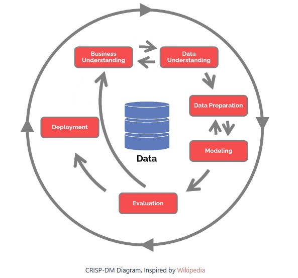
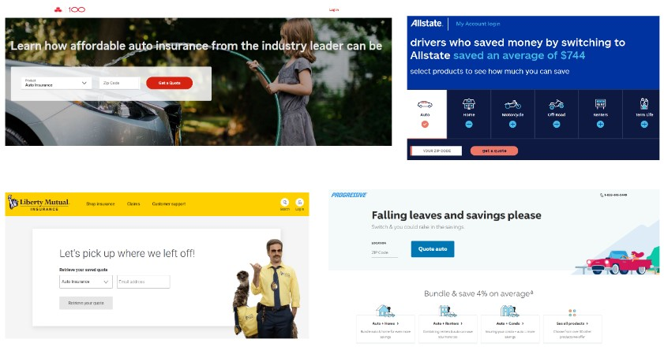
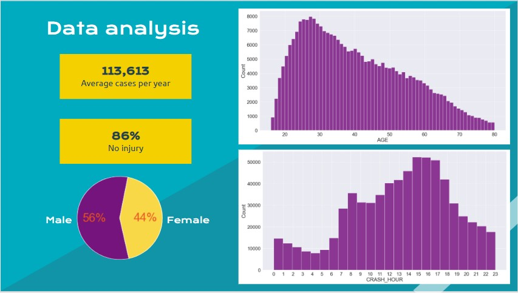
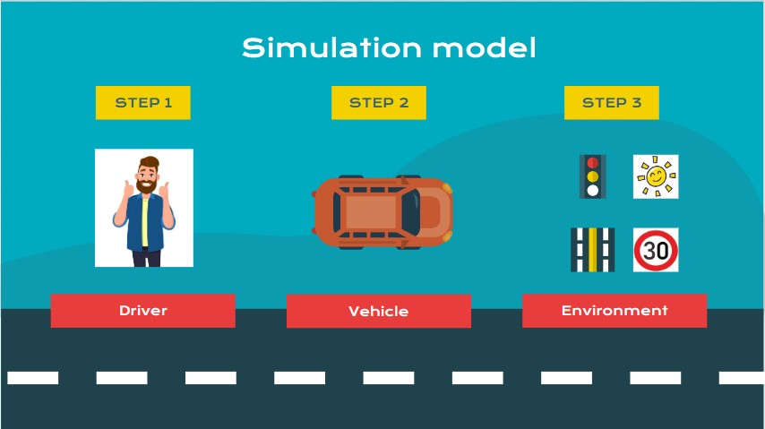
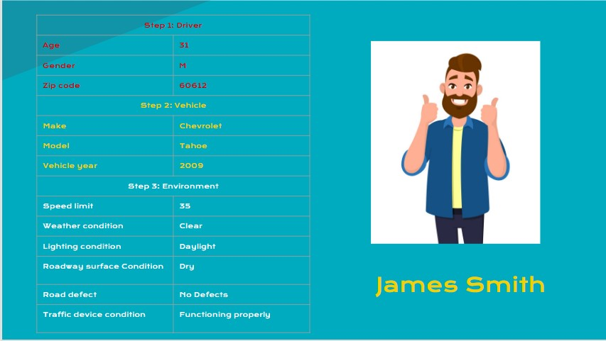
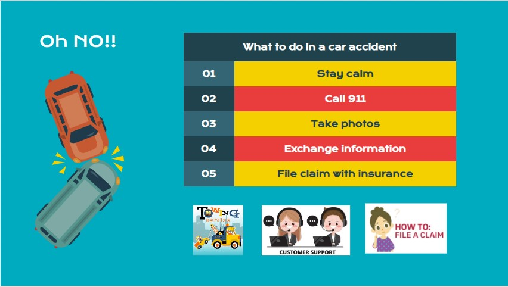
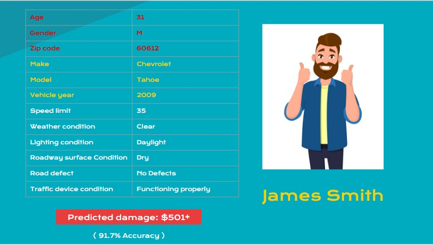
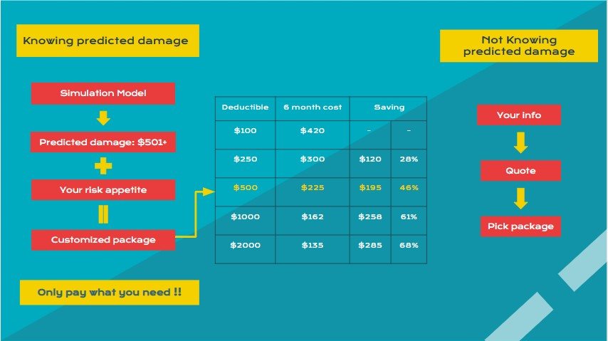

# Apply the vehicle damage prediction to Mutual Fund Insurance

## CRIPS-DM process 

Initially, I followed the CRIPS-DM process as I always do and setted up the goal to find the best model of predicting the target, ‘DAMAGE’. The predition could be
used as a reference for the customers while purchasing new policies.

[Resource link](https://www.datascience-pm.com/crisp-dm-2/)

## The inspiration

I was inspired by the similarity of insurance companies’ websites and how they provide quotes to customers.  With my background and experience in Risk Management,
Insurance, Banking and Finance, I emphasized the difficulties and challenges the companies are facing.  Despite all the other agendas, the first and biggest 
challenge for a company is how to expand their customer quantity and quantity.  How to win more new customers and securing the existing customers has always been
the number 1 topic in any company meetings.  So, this got me thinking.  They all need to attract new customers, how can their websites look all the same?  No one is doing anything different that could stand out in the crowd. They to do better!

Taking the advantage of the knowledge I have in the insurance industry, I am aware that insurance can make uncertainty into certainty by taking on a large 
number of observations.  There are plenty of subjects that can be addressed or discussed how insurance takes on and handles risks.  To the individuals, buying
auto insurance is a must because the law and regulation suggests so.  No one really wishes to make a claim if they don’t need to.  Because that would mean something
unfortunate had happened.  Buying insurance is more like “gambling” to individuals.  It is just like that I always struggle with how much I should put into my FSA
account because I don’t know how much I will actually need in self-paid medical expenses next year.  Wouldn’t it be nice if I can have a prediction of my cost if
something happens next year?  That would get me a real feeling of how I should re-allocate the money in the pocket.

Since my model is predicting the DAMAGE, if auto insurance companies can provide this information to their customers that would help the customers with their 
decision making on choosing the right deductible and packages.  This would be an innovative offer from auto insurance companies to their customers!

## Data analysis

I took the car accident datasets reported by Chicago Police Dept in the past 6 years, and here is the quick summary for it.
The average number of cases per year is around 113K. That’s 311 cases per day.
And 86% of them have no people injured.
There are more male involved in accidents than females.
From the Age distribution, we found the peak is at the age of 27.  Generally speaking, people’s driving skills get better when they are more experienced.
As we grow older and have more responsibilities along the way of our life journey, we drive more carefully and wisely.
From the Crash hour distribution, without doubt, the peak reflects the rush hours.

## Simulation model

With the data I have, I came up with the idea of publishing a simulation model on othe website that can help customers with the process of customizing their 
insurance packages.  So they will only pay what they need!  And here is the brief introduction to my simulation model.

For the first glance, it looks very similar to the quote process on our website.  However, the main difference is, within my simulation model, customers are the 
one who’s driving and taking all the controls.  In the simulation model, they will be more proactive and interactive.  Customers will have more fun with their
purchasing experience and also be informed with usful information.

This is how it works.  First, customers need to set up the driver, vehicle and environment that actually reflects reality.

(Note that all the input items required here are actually the features in my models.)

For example, James, a 31 year old man living in 60612, driving a 2009 Chevrolet Tahoe, has setted up the environment that mirrors most of his days.

Down the road, if an accident happens. Within the simulation model, I could predict the damage to his vehicle based on the real data from the past.  
Meanwhile, I will also plug in some resources and  information to pre-educate customers what to do in the situation.

(Note the predicted damage is the target(y) in my models.)

As a result, my model generates the prediction that James’ predicted damage is $501 and more, with 91.7% accuracy.

Now with knowing the predicted damage, it will be easier for James to decide how to customize his own insurance package, considering his risk appetite 
and preference.  Is he more aggressive or more conservative with taking on uncertainties?  If James is willing to pay up to 500 out of pocket to fix 
his car, and he knows the predicted damage is more than 500, then, for sure, $500 deductible is best for him and that would save him $195 for a 6-month policy.

## Conclusion and behind the scenes

### Conclusion
Within my simulation model, customers will be able to insert their real life and personal risk appetite into insurance quote process.  They would feel 
they finally have the power and control because their input matters.  The simulation model will be the action we take to respond to the promise we make 
to our customers by telling them “only pay what you need!”

### Behind the senses 
Lastly, I want to touch on what’s behind the senses and what more I want to accomplish.

Area: right now, the simulation model is only suitable for customers in Chicago. I would love to make it national.

Data:I need more data collected from the entire nation.  And I would merge them with our database.  So I can link the real accident scenes with our insurance 
claim data.  Then my simulation model can make predictions more precisely and spectacularly.

Corss-working: To conduct this proposal into a real project, I will be leading my team and cross working with the animation design, app developing, and customer relationship teams.

### For the data and models, plese see the [main notebook](/main.ipynb)
