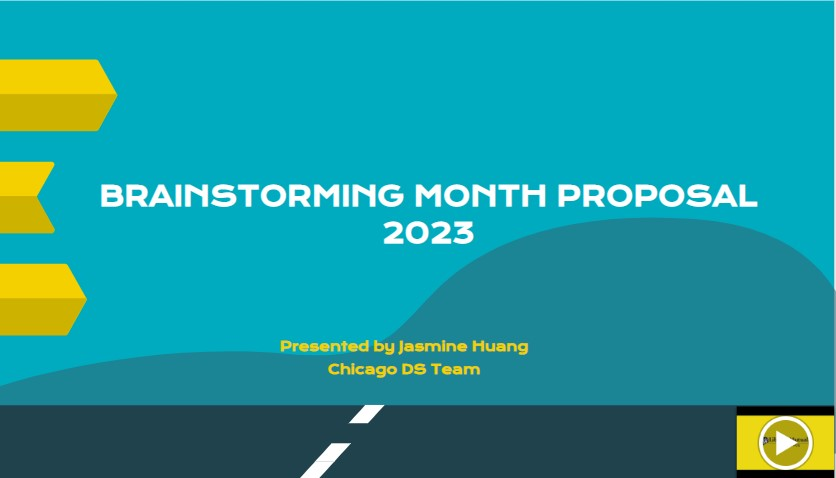
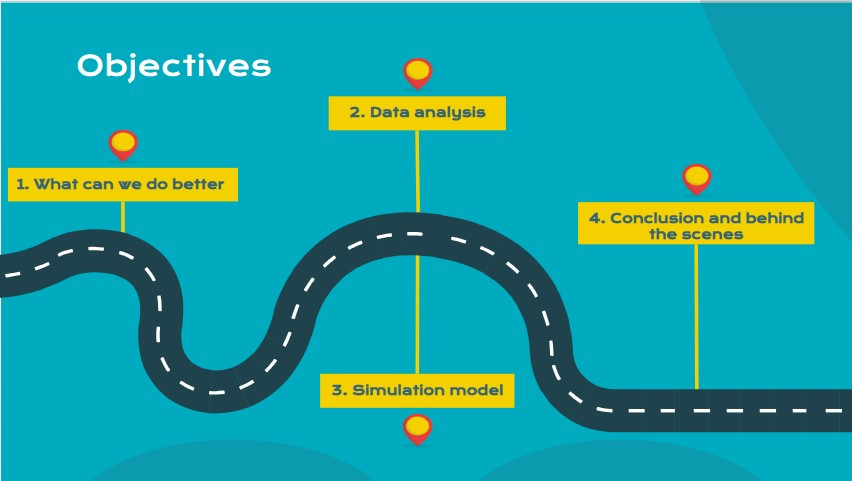
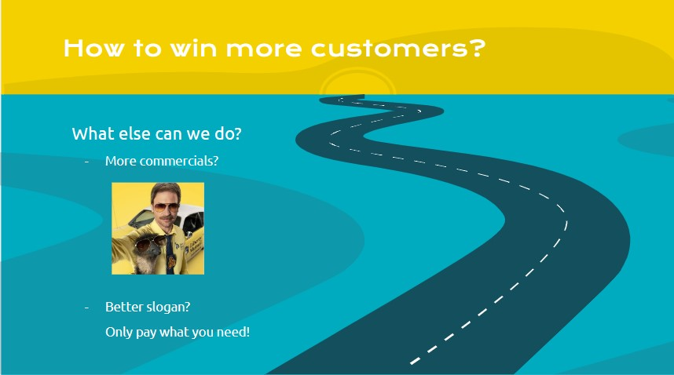
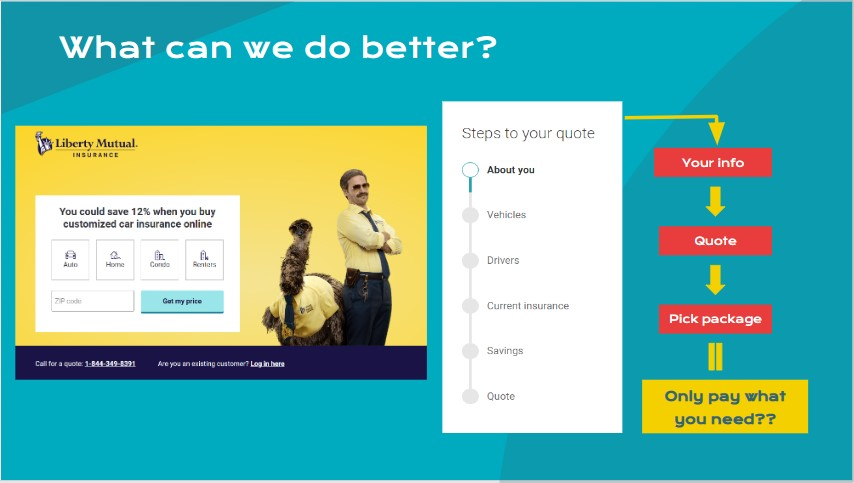
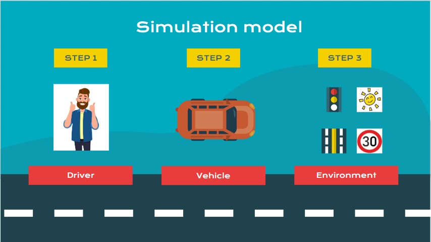
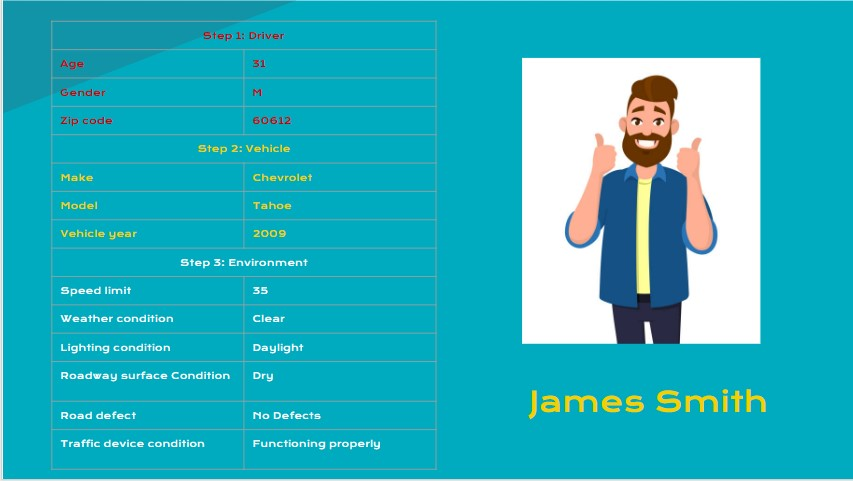
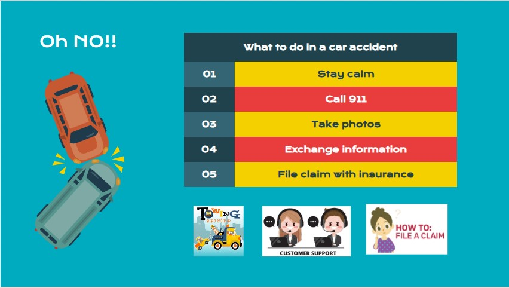
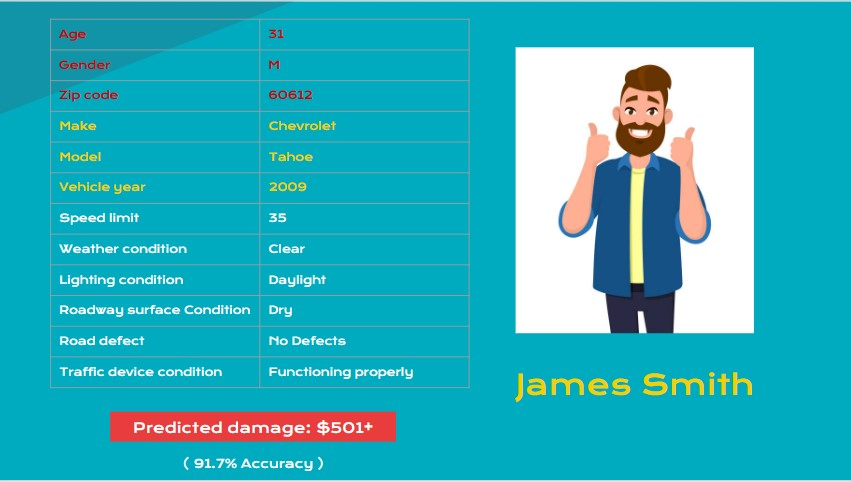
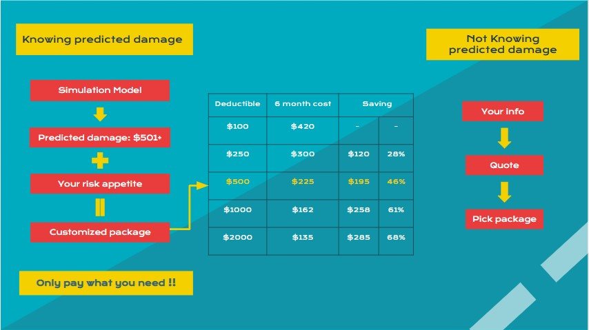
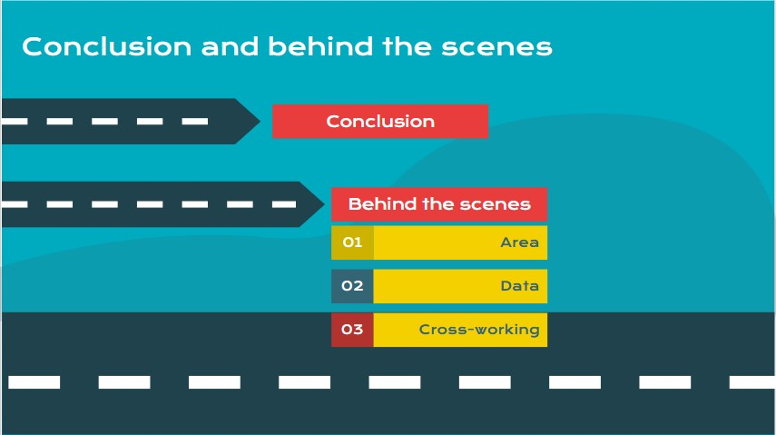

# Mutual Fund Insurance Brainstorming Month Proposal 2023

### Hold!!  I ended up taking a very different approach for this project so this README is going to be very different from the usual ones.  

Becuase the innovative approach I am taking, this prject is devided into 2 parts.
First part is my presentation which is recorded in this README below.  My presentation will explain the background and give you a quick view of my vision. 
Second part is the workflow how I handel and process the data and models.  This part is journaled in the notebooks.

# The process of my thinking and the turns  

First, I followed the CRIPS-DM as I always do and setted up the goal to find the best model of predicting the target, ‘DAMAGE’.  Then I jumped into the data, 
models and all the hoops and loops, which are all well noted in the notebooks. 

After I finished the workflow and got my best model, I started to prepare for my presentation.  I kept thinking, thinking and more thinking.  How can I make my 
models useful and meaningful to the business?  How can I wrap the models and business in a stronger and nicer way?
While all those questions were buzzing in my head, I didn’t slow down on editing my slides.  I looked into some insurance companies' websites to see how they 
provide quotes.  Surprisingly, they looked so similar and simple.  And this got me an idea!

# The inspiration

I was inspired by the similarity of insurance companies’ websites and how they provide quotes to customers.  I finally found where I can start the blueprint 
of my presentation.

# Outlines
1. Intro: Brainstorming Month Proposal 2023
2. Objectives
3. How do we win more customer and what can we do better?
4. Data analysis
5. Simulation model
6. Conclusion and behind the scenes

## 1. Intro: Brainstorming Month Proposal 2023

Liberty Mutual is celebrating the company's traditional event in January, Brainstorming Month, to gather and explore new ideas of how to make the company better 
in any way.

## 2. Objectives

First, I will start with one thing that we can do better from my research.
Second, I will show the data analysis.
Then, and most importantly, I will introduce the simulation model.
Last, I would like to talk about what more I want to accomplish and what’s going on behind the scenes.

## 3. How do we win more customer and what can we do better?

How to win more customers has always been the biggest challenge for any company.  We have done so much already.  What else can we do?

#### Should we buy more commercials?
Everyone loves our Limu Emu and Doug.  Yes, we shall buy more commercials if budget allows it.  

#### Should we have a better slogan?
We told customers, “only pay what you need.”
By saying that, we want to show customers we are on their side.  But, how can we make customers feel our passion?
Reviewing how we provide quotes today, does that really line up with our slogan? Hum.....
That got me thinking about how we can do this from customer's perspective, and that’s the inspiration of my proposal. 

This is the frontpage of our website.  Just like our competitors.  We start with having customers fill out a questionnaire, and, at the end we tell them 
how much we are going to charge them.
So the question is, what can we do that’s different, unique and outstanding?

## 4. Data analysis

I took the car accident datasets reported by Chicago Police Dept in the past 6 years, and here is the quick summary for it.
The average number of cases per year is around 113K. That’s 311 cases per day.
And 86% of them have no people injured.
There are more male involved in accidents than females.
From the Age distribution, we found the peak is at the age of 27.  Generally speaking, people’s driving skills get better when they are more experienced.
As we grow older and have more responsibilities along the way of our life journey, we drive more carefully and wisely.
From the Crash hour distribution, without doubt, the peak reflects the rush hours.

## 5. Simulation model

With the data I have, I came up with the idea of publishing a simulation model on our website that can help customers with the process of customizing their 
insurance packages.  So they will only pay what they need!  And here is the brief introduction to my simulation model.

For the first glance, it looks very similar to the quote process on our website, doesn’t it?  Well, the main difference is, within my simulation model, 
customers are the one who’s driving and taking all the controls.  In the simulation model, they will be more proactive and interactive.  I want the 
customers to have fun with their purchasing experience and also keep it informative.

This is how it works.  First, customers need to set up the driver, vehicle and environment that actually reflects reality.

(Note that all the input items required here are actually the features in my models.)

For example, James, a 31 year old man living in 60612, driving a 2009 Chevrolet Tahoe, has setted up the environment that mirrors most of his days.

Down the road, if an accident happens. Within the simulation model, I could predict the damage to his vehicle based on the real data from the past.  
Meanwhile, I will also plug in some resources and  information to pre-educate customers what to do in the situation.

(Note the predicted damage is the target(y) in my models.)

As a result, my model generates the prediction that James’ predicted damage is $501 and more, with 91.7% accuracy.

Now with knowing the predicted damage, it will be easier for James to decide how to customize his own insurance package, considering his risk appetite 
and preference.  Is he more aggressive or more conservative with taking on uncertainties?  If James is willing to pay up to 500 out of pocket to fix 
his car, and he knows the predicted damage is more than 500, then, for sure, $500 deductible is best for him and that would save him $195 for a 6-month policy.

## 6. Conclusion and behind the scenes

#### Conclusion
Within my simulation model, customers will be able to insert their real life and personal risk appetite into insurance quote process.  They would feel 
they finally have the power and control because their input matters.  The simulation model will be the action we take to respond to the promise we make 
to our customers by telling them “only pay what you need!”

#### Behind the senses 
Lastly, I want to touch on what’s behind the senses and what more I want to accomplish.

Area: right now, the simulation model is only suitable for customers in Chicago. I would love to make it national.

Data:I need more data collected from the entire nation.  And I would merge them with our database.  So I can link the real accident scenes with our insurance 
claim data.  Then my simulation model can make predictions more precisely and spectacularly.

Corss-working: To conduct this proposal into a real project, I will be leading my team and cross working with the animation design, app developing, and customer relationship teams.

### For the data and models, plese see the main notebook.
